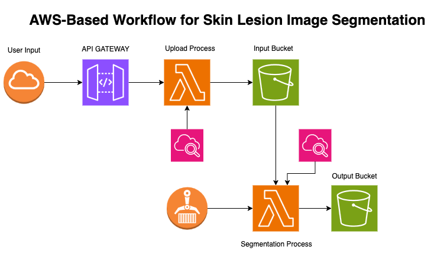
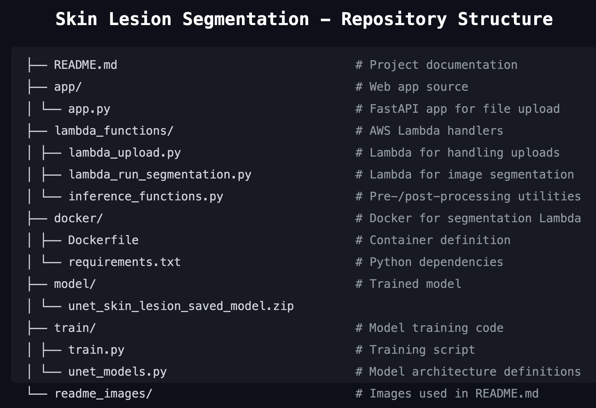

# Skin-Lesion-Segmentation-with-AWS-Deployment

This repository demonstrates a complete end-to-end pipeline for skin lesion (mole) segmentation using a U-Net model trained on the ISIC2018 dataset. The trained model is deployed to AWS using S3, API Gateway, Lambda functions, and ECR.

## Key Features

- **Model Training**: U-Net trained on ISIC2018 dataset, saved in TensorFlow SavedModel format.
- **Cloud Storage**: Model artifacts stored in S3 under `skin-segmentation-app/model`.
- **Web Interface**: `app.py` provides a UI to upload images via API Gateway.
- **Lambda Upload**: `lambda_upload.py` parses JSON POST requests containing Base64‑encoded image data, decodes and validates the image, then stores it under the `input/` prefix in S3.

The system follows a serverless architecture pattern:

1. Users upload images through a FastAPI web application  
2. The application sends images to an API Gateway endpoint  
3. API Gateway triggers the first Lambda function (`lambda_upload.py`)  
4. The Lambda function saves the image to an S3 bucket in the `input` directory  
5. The S3 upload event triggers a second Lambda function (`lambda_run_segmentation.py`)  
6. This Lambda function:
   - Loads the pre-trained U-Net model from S3  
   - Preprocesses the image  
   - Performs segmentation  
   - Overlays the segmentation on the original image  
   - Saves the result to another S3 bucket for output  

